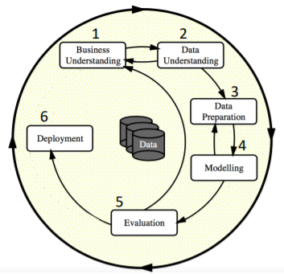

# Gruppe 4: Teil Data Science

Machine Learning am Beispiel des "[Heart Disease](http://archive.ics.uci.edu/ml/datasets/Heart+Disease)" Datensatzes , anhand der CRISP Data Mining Vorgehensweise.

Die genaue Vorgehensweise ist im abgegebenen Laborbericht festgehalten.

